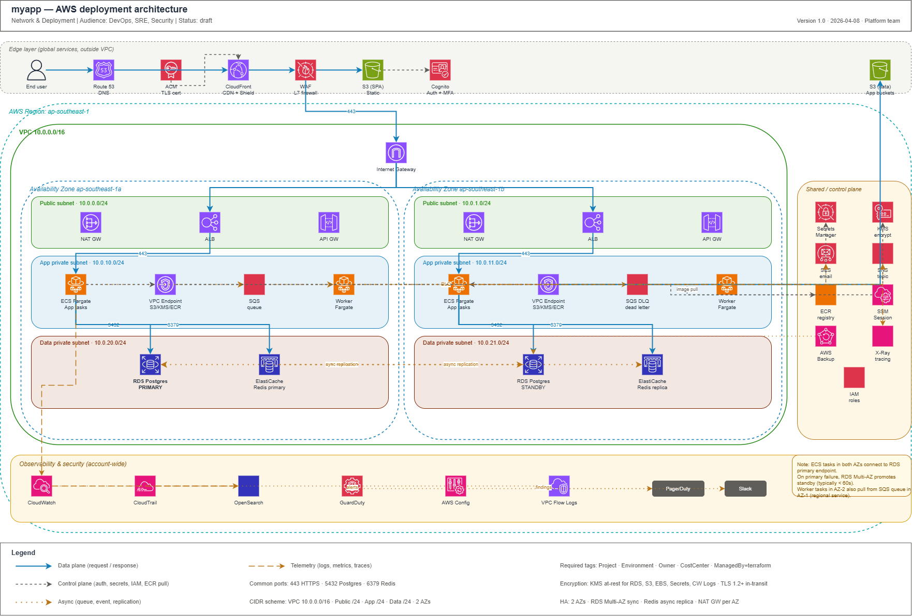

# MyApp Infrastructure

Infrastructure-as-Code project for a 3-tier web application on AWS, using Terraform and GitHub Actions.

## Architecture Overview



**Main components:**

- **Edge Layer**: Route 53 → CloudFront + WAF/Shield → S3 (SPA static hosting)
- **Public Subnet**: ALB, NAT Gateway, Internet Gateway
- **App Private Subnet**: ECS Fargate, API Gateway, VPC Endpoints
- **Data Private Subnet**: RDS PostgreSQL (Multi-AZ), ElastiCache Redis, Backup
- **Observability**: CloudWatch, CloudTrail, GuardDuty, AWS Config, X-Ray, OpenSearch

## Project Structure

```
terraform/
├── modules/          # Reusable modules
│   ├── networking/   # VPC, subnets, NAT, IGW, VPC endpoints
│   ├── security/     # KMS, Secrets Manager, IAM, Security Groups
│   ├── edge/         # CloudFront, WAF, ACM, Route53
│   ├── compute/      # ECS Fargate, ALB, API Gateway, Cognito
│   ├── data/         # RDS, ElastiCache, S3, AWS Backup
│   └── observability/# CloudWatch, OpenSearch, GuardDuty, Config
├── envs/             # Per-environment configurations
│   ├── dev/
│   ├── staging/
│   └── prod/
└── global/           # One-time global resources
    ├── backend/      # S3 state bucket + DynamoDB lock
    ├── iam/          # GitHub OIDC provider
    └── route53/      # Public hosted zone
```

## Environments

| Environment | Purpose | Auto-deploy | Approval |
|---|---|---|---|
| dev | Development, testing | Push to main | No |
| staging | Pre-production | Tag `rc-*` | 1 reviewer |
| prod | Production | Tag `v*.*.*` | 2 reviewers |

## Quick Start

1. **Install tools**: See [docs/onboarding/getting-started.md](docs/onboarding/getting-started.md)
2. **Bootstrap state**: `./scripts/bootstrap.sh dev`
3. **Deploy dev**: `cd terraform/envs/dev && terraform init && terraform apply`

## Naming Conventions

- Pattern: `{project}-{env}-{resource}` (e.g.: `myapp-prod-rds-main`)
- Required tags: `Project`, `Environment`, `Owner`, `CostCenter`, `ManagedBy=terraform`

## CI/CD Workflows

| Workflow | Trigger | Description |
|---|---|---|
| `terraform-plan` | Pull Request | Plan all affected envs, comment on PR |
| `terraform-apply` | Push to main | Auto-apply dev |
| `terraform-promote` | Tag `rc-*` / `v*.*.*` | Deploy staging/prod with approval |
| `terraform-destroy` | Manual | Destroy dev/staging |
| `drift-detection` | Cron (02:00 UTC) | Detect drift, alert Slack |
| `security-scan` | Pull Request | tflint, tfsec, checkov, trivy |
| `docs` | Push to main | Auto-generate terraform-docs |

## Documentation

- [Architecture Overview](docs/architecture/overview.md)
- [Operations Runbooks](docs/runbooks/)
- [Onboarding](docs/onboarding/getting-started.md)

## Placeholders to Replace

Find and replace the following placeholders before deploying:

| Placeholder | Description |
|---|---|
| `<ACCOUNT_ID_DEV>` | AWS Account ID for dev env |
| `<ACCOUNT_ID_STAGING>` | AWS Account ID for staging env |
| `<ACCOUNT_ID_PROD>` | AWS Account ID for prod env |
| `<DOMAIN>` | Primary domain (e.g.: `myapp.com`) |
| `<ALERT_EMAIL>` | Email to receive alerts |
| `<SLACK_WEBHOOK_URL>` | Slack webhook for drift alerts |
| `<GITHUB_ORG>` | GitHub organization name |
| `<GITHUB_REPO>` | GitHub repository name |
| `<COST_CENTER>` | Cost center code |
| `<OWNER>` | Team/owner |
